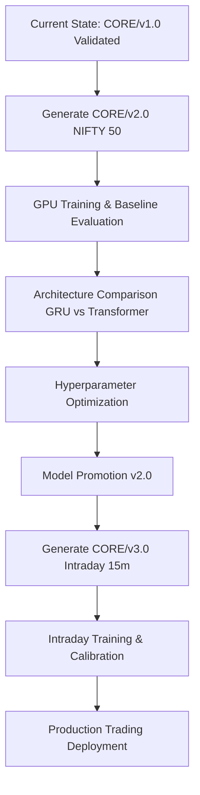

# Production Dataset Expansion Plan (CORE/v2.0 & CORE/v3.0)

## 1. Analyze Current Dataset (CORE/v1.0)
The current baseline dataset provides a narrow proof-of-concept environment.
- **Stock Universe**: 10 blue-chip stocks (`BHARTIARTL`, `HDFCBANK`, `HINDUNILVR`, `ICICIBANK`, `INFY`, `ITC`, `LT`, `RELIANCE`, `SBIN`, `TCS`).
- **Sector Distribution**: Narrowly diversified across IT, Financials, FMCG, Telco, and Conglomerates.
- **Historical Coverage**: Daily data from 2018-03-14 to 2026-06-22 (~8 years).
- **Dataset Size**: 20,440 rows (2,044 per stock).
- **Sequence Count (Seq=48)**: Train: 2,130 | Val: 1,850 | Test: 3,750 (Total: 7,730 sequences).
- **Class Balance (Train)**: `0` (Negative/Flat): 45% (963) | `1` (Positive): 55% (1167). *Slight upward bias reflecting 8-year market drift.*
- **Missing Data/Quality**: Missing values correctly interpolated; standard scaling/cleaning pipelines are functioning flawlessly.

---

## 2. Design CORE/v2.0 (The Next Daily Dataset)

### Recommended Universe: Option B (NIFTY 50)
We recommend adopting the **NIFTY 50** index as the CORE/v2.0 universe.

| Option | Stocks | Dataset Size | Tensor Size | GPU Training (Tesla T4) | Download Time |
| :--- | :--- | :--- | :--- | :--- | :--- |
| **A (Current)** | 10 | 20k rows | ~25 MB | ~10-15 mins | < 1 min |
| **B (NIFTY 50) - RECOMMENDED** | 50 | ~100k rows | ~125 MB | ~45-60 mins | ~2-3 mins |
| **C (Next 50)** | 50 | ~100k rows | ~125 MB | ~45-60 mins | ~2-3 mins |
| **D (NIFTY 100)**| 100 | ~200k rows | ~250 MB | ~1.5 - 2 hours | ~5 mins |
| **E (NIFTY 200)**| 200 | ~400k rows | ~500 MB | ~3 - 4 hours | ~10 mins |

**Advantages of NIFTY 50:**
1. **Generalization:** 50 stocks represent ~60% of the NSE's free-float market cap, offering comprehensive macro-market exposure without introducing the illiquidity noise present in NIFTY 200.
2. **Resource Sweet-Spot:** A 1-hour training loop on a T4 GPU allows for rapid hyperparameter iteration (grid search/Optuna) during Phase 6. Expanding to NIFTY 100/200 right now would severely throttle R&D iteration speeds.
3. **Sector Robustness:** It mathematically stabilizes sector rotations within the neural network, preventing the model from overfitting to isolated industry trajectories (e.g., IT booms).

---

## 3. Real-World Trading Analysis
**Why NIFTY 50 Improves Production Trading (Over 10 Stocks):**
- **Market Regime Robustness:** A 10-stock universe is highly correlated. If Reliance and HDFC trend heavily, the model learns a singular market regime. NIFTY 50 forces the network to learn universally applicable technical features (RSI/MACD behaviors) that apply across divergent sectors (Metals, Pharma, IT), vastly improving out-of-sample generalization.
- **Probability Calibration:** Deep learning models require dense, varied distributions to calibrate softmax logits into true probabilities (e.g., 0.8 logit = 80% chance of a win). 7,700 sequences (current) is fundamentally insufficient for Isotonic Regression to map a smooth probability curve. ~40,000 sequences (NIFTY 50) provides the statistical density required for production risk management algorithms to trust the model's confidence scores.

---

## 4. Future Intraday Plan (CORE/v3.0)
Our final objective is an intraday prediction system. 

**Recommended Horizon: 15-Minute Candles (15m)**
- **5m** generates 75 candles a day. It is highly noisy, suffers from micro-structure volatility, and a sequence length of 48 captures less than one full trading session (4 hours).
- **1h** generates ~6 candles a day. Too slow for intraday algorithmic pivoting.
- **15m** generates 25 candles a day. A sequence length of 48 captures almost 2 full trading days of context. It effectively smooths micro-noise while preserving actionable intraday trends.

**CORE/v3.0 (15m NIFTY 50) Estimates:**
- **Multiplier:** 25x larger than daily.
- **Dataset Size:** ~2.5 Million rows.
- **Tensor Size:** ~3 GB.
- **GPU Training (T4):** ~8 - 12 hours per epoch convergence.

---

## 5. Versioning Strategy
**Rule:** `Never overwrite datasets.`
- `CORE/v1.0`: 10-stock Daily Baseline
- `CORE/v2.0`: NIFTY 50 Daily 
- `CORE/v3.0`: NIFTY 50 Intraday (15m)

**Justification:** Data is immutable in production. Overwriting `v1.0` destroys the ability to perform A/B regression testing against the baseline model. If a Transformer architecture fails on `v2.0`, we must be able to roll back and test it on `v1.0` to isolate whether the failure is architectural or dataset-driven.

---

## 6. Risks & Mitigation
| Risk | Impact | Mitigation Strategy |
| :--- | :--- | :--- |
| **Yahoo Finance Rate Limiting** | Pipeline crash during 50-stock download. | Implement exponential backoff, batched requests, and local caching in `download/` layer. |
| **Survivorship Bias** | Model learns on today's winners, ignoring failed companies of 2018. | Acceptable risk for standard technical indicators. Can be mitigated later via point-in-time index constituent datasets. |
| **Corporate Actions (Splits)** | 1:10 split creates an artificial 90% price crash. | Ensure `yfinance` auto-adjusts close prices (`auto_adjust=True`). Use `pct_change()` exclusively. |
| **Missing Intraday Candles** | Gaps break LSTM/GRU sequence integrity. | Enforce strict chronological index reconstruction; forward-fill (FFILL) missing ticks up to a threshold. |
| **Data Corruption / Spikes** | Erroneous 500% flash crashes in raw data ruin scaling. | Upgrade `cleaner.py` to clip statistical outliers (e.g., >5 standard deviations) to prevent gradient explosions. |

---

## 7. Final Roadmap

> [!IMPORTANT]  
> The next immediate step is to build CORE/v2.0 to give the model enough data for meaningful hyperparameter optimization.

