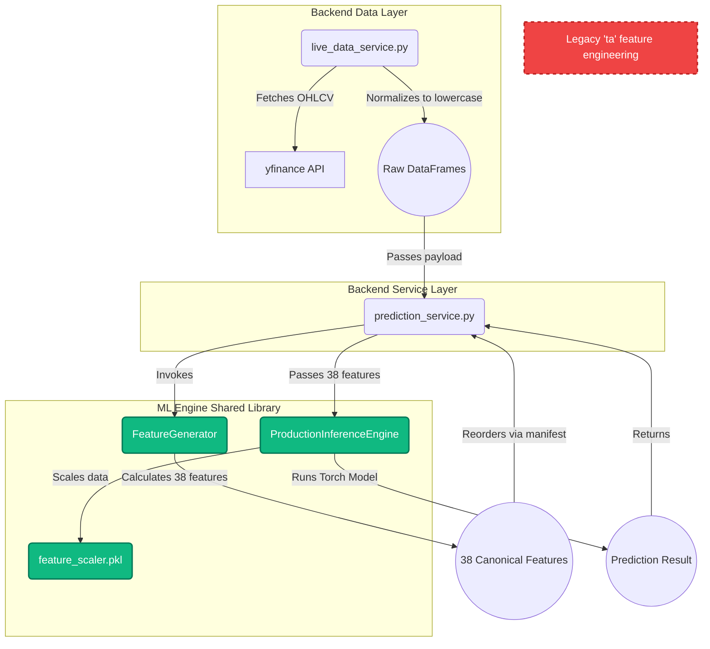

# M22.1 – Feature Engineering Unification Design Review

## 1. Canonical Feature Engineering Implementation
The canonical implementation serving as the single source of truth for all training features is the **`FeatureGenerator`** class located in:
`ml_engine/data/features/generator.py`
The primary entry point is the method: `generate_all_features(self, df: pd.DataFrame, market_data: Dict[str, pd.DataFrame] = None)`

## 2. Reusability & Coupling Verification
**Verified: It is highly reusable and completely decoupled from dataset generation.**
The `FeatureGenerator` is a pure function-like orchestrator. It does not hit databases, manage files, or handle labels. It accepts any arbitrary Pandas DataFrame (representing a single asset's price history) and an optional dictionary of market benchmark DataFrames. 

*Requirement*: The only minor coupling is a strict dependency on lowercase OHLCV column names (`open`, `high`, `low`, `close`, `volume`) which is a standard Pandas convention easily accommodated by `live_data_service`.

## 3. Reusable Production Unit
Since it is not tightly coupled, the entire `FeatureGenerator` class itself serves as the perfect reusable production unit. No internal refactoring of `generator.py` is necessary.

## 4. Proposed Production Architecture
To permanently eliminate training-serving skew and eliminate duplicate logic, we will implement the following unified architecture:

1. **`live_data_service.py` (Raw Ingestion Only)**
   * Retains `yfinance` download logic.
   * Downloads the primary `stock`, plus `^NSEI` (NIFTY 50) and `^INDIAVIX` (VIX).
   * Normalizes all DataFrame columns to lowercase.
   * Eliminates all usage of the `ta` library, dropping all manual indicator calculations.
   * Returns a raw `market_data` payload to the Prediction Service.

2. **`prediction_service.py` (Orchestration)**
   * Receives the raw market payload.
   * Instantiates `FeatureGenerator()` from `ml_engine`.
   * Calls `generate_all_features(df=primary_df, market_data={'^NSEI': nifty, '^INDIAVIX': vix})`.
   * Orders the columns strictly according to the active `manifest.json`.
   * Passes the final `feature_array` to `ml_adapter.inference_engine.predict()`.

3. **`ml_adapter` / `inference_engine`**
   * Uses the registry's `feature_scaler.pkl` to transform the array.
   * Executes inference on the neural network.

## 5. De-Duplication Verification
Once implemented, this architecture guarantees zero duplicated logic. `live_data_service` will shrink from ~190 lines of manual math down to ~40 lines of pure network IO. The entire repository will route through `ml_engine.data.features.generator.FeatureGenerator`.

## 6. Target Architecture Diagram

