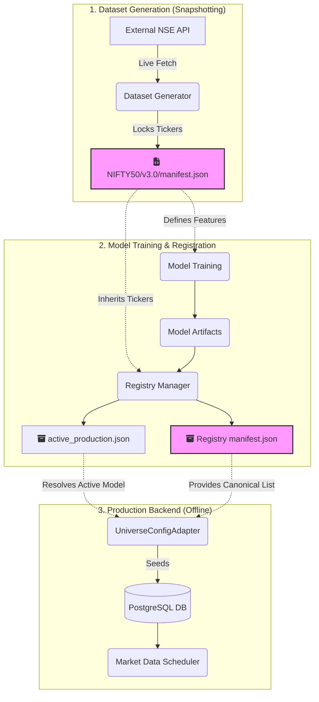

# Production Architecture Review: Canonical Universe Ownership

## Evaluation of Options

### Option A: UniverseManager with Version-Controlled Local File (JSON/YAML)
- **Reproducibility**: High (Git tracked).
- **Deployment Safety**: Low. If a single `nifty50.json` file is updated in the repository, a backend deployment might pull the new file while still serving an older model, causing an immediate runtime crash. Versioning the files (e.g., `nifty50_v3.json`) mitigates this but clutters the repository with data artifacts.
- **Offline Operation**: Yes, works without internet.
- **Deterministic Registration**: Yes.
- **Retraining Reproducibility**: Yes.
- **CI/CD Friendliness**: High.
- **Production Maintainability**: Medium. Requires manual Git commits to update the stock list whenever the NSE index is rebalanced.

### Option B: Dataset Manifest Becomes the Canonical Owner
- **Reproducibility**: High. The exact tickers used are permanently locked into the immutable dataset manifest artifact at generation time.
- **Deployment Safety**: High. The backend dynamically resolves the active dataset manifest corresponding to the loaded model. A new dataset (v4.0) does not overwrite v3.0, ensuring safe, atomic deployments and flawless rollbacks.
- **Offline Operation**: Yes. The generated manifest is a local artifact bundled with deployments.
- **Deterministic Registration**: High. The registry inherits the universe directly from the exact dataset used for training.
- **Retraining Reproducibility**: High. The manifest explicitly defines the exact historical universe to download if regeneration is needed.
- **CI/CD Friendliness**: High. Artifact-driven architecture is the gold standard for MLOps.
- **Production Maintainability**: High. Zero manual maintenance of lists in source code. The dataset generator fetches the live universe from the exchange during execution, locking it into the manifest permanently.

### Option C: UniverseConfig Becomes the Canonical Owner
- **Reproducibility**: High (Git tracked).
- **Deployment Safety**: Low. Updating a hardcoded Python dictionary breaks any currently deployed models that expect older universes.
- **Offline Operation**: Yes.
- **Deterministic Registration**: High.
- **Retraining Reproducibility**: Yes.
- **CI/CD Friendliness**: Low. Changing the universe requires modifying Python code rather than updating configuration or artifacts.
- **Production Maintainability**: Low. Extremely error-prone and violates Clean Architecture by embedding data inside code.

---

## Recommendation

**Option B (Dataset manifest becomes the canonical owner)** is the only production-grade solution that guarantees deployment safety, eliminates manual code updates, and adheres to MLOps best practices.

By decoupling data from code, the dataset generator acts as the "snapshotting" mechanism—it captures the live universe (e.g., via the NSE API) and permanently locks it into the `dataset/manifest.json`. From that point forward, the immutable dataset manifest serves as the single source of truth for the entire pipeline (Training → Registry → Backend Seeding → Scheduler). This ensures that if the active ML model is rolled back to v3.0, the backend and scheduler automatically and safely revert to the exact 50 stocks present in the v3.0 dataset manifest.

## Recommended Production Architecture

